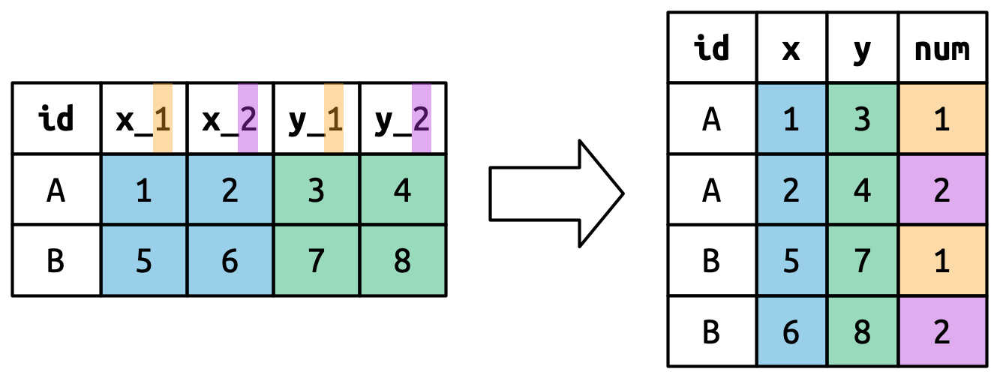

```{r setup, include=FALSE}
knitr::opts_chunk$set(echo = TRUE, paged.print = FALSE)
```

# Data Tidying

## Tidy data

There are three interrelated rules that make a dataset tidy:

1.  Each variable is a column; each column is a variable.
2.  Each observation is a row; each row is an observation.
3.  Each value is a cell; each cell is a single value.

```{r}
library(tidyverse)
```

```{r}
table1
```

```{r}
table2
```

```{r}
table3
```

> Compute rate per 10,000

```{r}
table1 |>
  mutate(rate = cases / population * 10000)
```

> Compute total cases per year

```{r}
table1 |> 
  group_by(year) |> 
  summarise(total_cases = sum(cases))
```

> Visualize changes over time

```{r}
ggplot(table1, aes(x = year, y = cases)) +
  geom_line(aes(group = country), color = "grey50") +
  geom_point(aes(color = country, shape = country)) +
  scale_x_continuous(breaks = c(1999, 2000))
```

## Lengthening data

### Data in column names

```{r}
billboard
```

> use `pivot_longer()` to create rows for each `wk*` column

```{r}
billboard |> 
  pivot_longer(
    cols = starts_with("wk"),
    names_to = "week", 
    values_to = "rank"
  )
```

```{r}
billboard |> 
  pivot_longer(
    cols = starts_with("wk"),
    names_to = "week", 
    values_to = "rank",
    values_drop_na = TRUE
  )
```

```{r}
billboard_longer <- billboard |> 
  pivot_longer(
    cols = starts_with("wk"),
    names_to = "week", 
    values_to = "rank",
    values_drop_na = TRUE
  ) |> 
  mutate(
    week = parse_number(week)
  )
billboard_longer
```

```{r}
billboard_longer |> 
  ggplot(aes(x = week, y = rank, group = track)) +
  geom_line(alpha = 0.25) +
  scale_y_reverse()
```

### Pivot example

```{r}
df <- tribble(
  ~id, ~bp1, ~bp2,
  "A",  100,  120,
  "B",  140,  115,
  "C",  120,  125
)
df
```

> Create three variables: id, measurement and value

```{r}
df |> 
  pivot_longer(
    cols = bp1:bp2,
    names_to = "measurement", 
    values_to = "value"
  )
```

### Many variables in column names

```{r}
who2
```

```{r}
who2 |> 
  pivot_longer(
    cols = !(country:year),
    names_to = c("diagnosis", "gender", "age"),
    names_sep = "_",
    values_to = "count"
  )
```

```{r}
who2 |> 
  pivot_longer(
    cols = !(country:year),
    names_to = c("diagnosis", "gender", "age"),
    names_sep = "_",
    values_to = "count",
    values_drop_na = TRUE
  )
```

### Data and variable names in column headers

```{r}
household
```

> Make a frame with columns `family`, `child`, `dob`, `name` with `.value`

```{r}
household |> 
  pivot_longer(
    cols = !family,
    names_to = c(".value", "child"),
    names_sep = "_",
    values_drop_na = TRUE
  )
```



## Widening data

### One observation is spread across multiple rows

```{r}
cms_patient_experience
```

```{r}
cms_patient_experience |> 
  distinct(measure_cd, measure_title)
```

```{r}
cms_patient_experience |> 
  pivot_wider(
    id_cols = starts_with("org"),
    names_from = measure_cd, 
    values_from = prf_rate
  )
```

### Pivot example

```{r}
df <- tribble(
  ~id, ~measurement, ~value,
  "A",        "bp1",    100,
  "B",        "bp1",    140,
  "B",        "bp2",    115, 
  "A",        "bp2",    120,
  "A",        "bp3",    105
)
```

```{r}
df |> 
  pivot_wider(
    names_from = measurement,
    values_from = value
  )
```

```{r}
df |> 
  select(-measurement, -value) |> 
  distinct() |> 
  mutate(x = NA, y = NA, z = NA)
```

```{r}
df <- tribble(
  ~id, ~measurement, ~value,
  "A",        "bp1",    100,
  "A",        "bp1",    102,
  "A",        "bp2",    120,
  "B",        "bp1",    140, 
  "B",        "bp2",    115
)

df |> 
  pivot_wider(
    names_from = measurement,
    values_from = value
  )
```

```{r}
df |> 
  group_by(id, measurement) |> 
  summarise(n = n(), .groups = "drop") |> 
  filter(n > 1)
```
